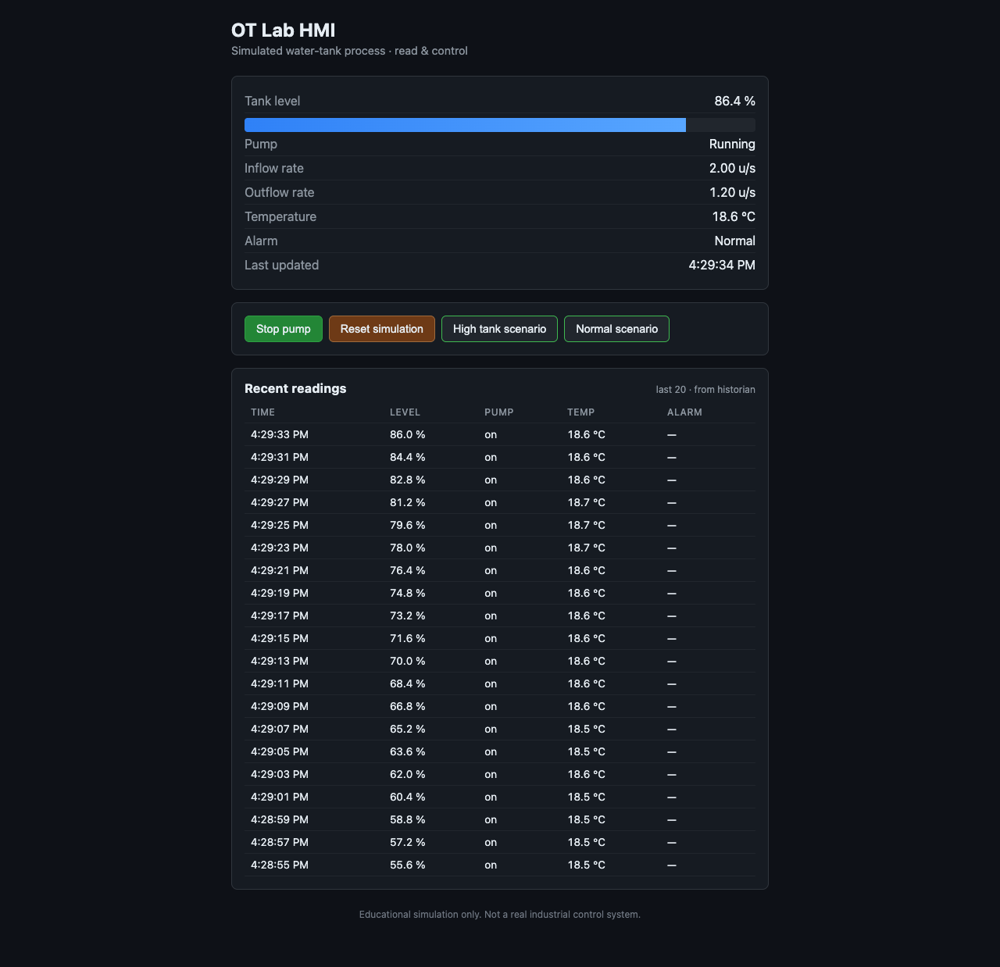
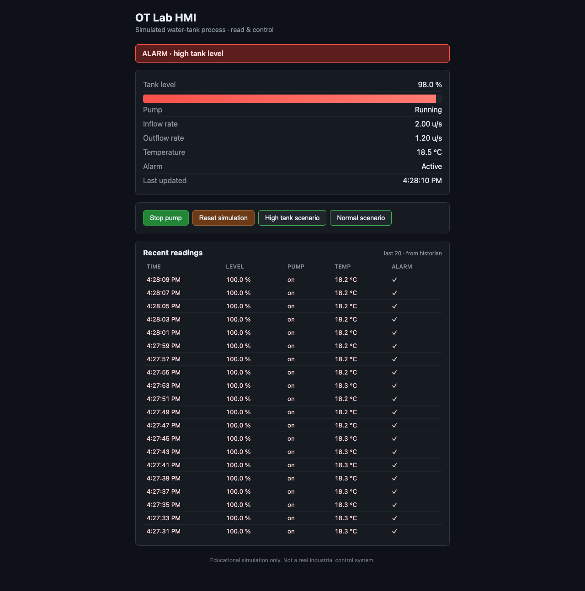
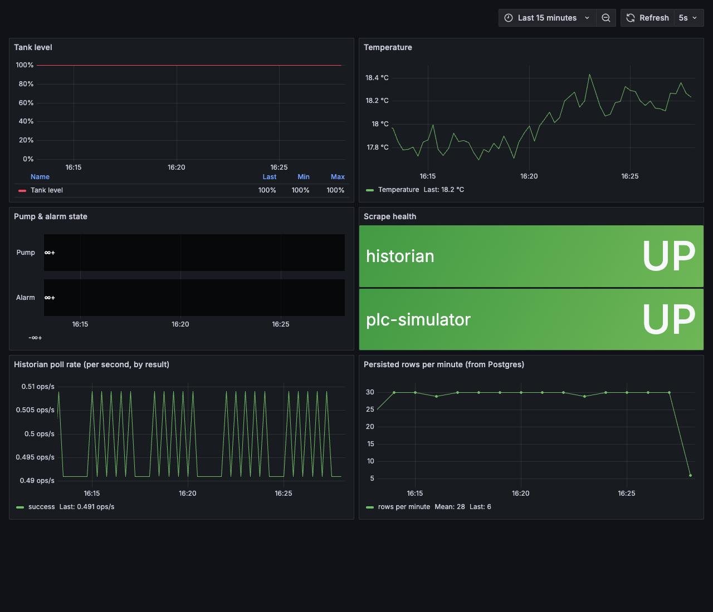
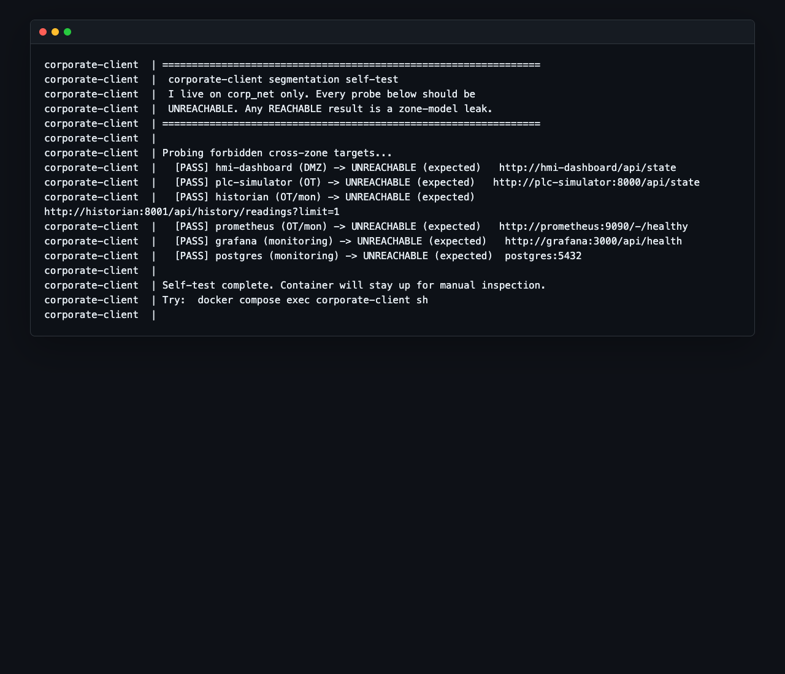

# OT Lab-in-a-Box

A fully local, Docker-based simulated operational technology (OT) environment
for learning infrastructure design, process monitoring, and OT/IT segmentation
concepts. The project is **educational and defensive only**.

A simulated water-tank PLC, an operator HMI, a historian backed by
PostgreSQL, and a Prometheus + Grafana monitoring stack run side by side
across four segmented Docker networks. Everything starts with one
`docker compose up`.

> This lab is a simulated OT environment for learning infrastructure design,
> monitoring, and segmentation concepts. It does not target real devices and
> should not be connected to production networks. The project is defensive
> and educational only.

## Status

**Phase 6** — portfolio polish and repeatable validation added. Services
are placed on four named Docker networks (`corp_net`, `dmz_net`, `ot_net`,
`monitoring_net`) modelling a corporate/DMZ/OT/monitoring split, and the
lab now includes deterministic failure demos for high tank alarm, PLC
unavailable, HMI connection loss, historian unavailable, and historian poll
errors. The repo also includes screenshots, a local smoke test, and GitHub
Actions CI. A `corporate-client` container self-tests the segmentation on
startup. The HMI and Grafana are the only host-published services.

The full roadmap is tracked in
[`ot_lab_in_a_box_project_plan.md`](ot_lab_in_a_box_project_plan.md).

## Tech stack

- **Containers & orchestration:** Docker, Docker Compose v2, four named
  bridge networks (`corp_net`, `dmz_net`, `ot_net`, `monitoring_net`).
- **Process simulator & historian:** Python 3.12, FastAPI, Uvicorn,
  Pydantic v2, `psycopg` 3 (PostgreSQL driver), `httpx`,
  `prometheus-client`.
- **Database:** PostgreSQL 16 (Alpine image), schema bootstrapped from
  `config/postgres/init.sql`.
- **Operator UI (HMI):** React 18, TypeScript, Vite, served in production
  by nginx that proxies API traffic into the OT zone.
- **Observability:** Prometheus (scrapes + alert rules), Grafana 11 with
  provisioned datasources and a pre-built dashboard.
- **Segmentation self-test:** Alpine + Bash container (`corporate-client`).
- **CI & validation:** GitHub Actions, `pytest`, a portable Bash smoke
  test (`scripts/smoke-test.sh`).

## What this demonstrates

- A segmented local OT/IT lab with corporate, DMZ, OT, and monitoring
  networks.
- A simulated PLC/process service, operator HMI, historian, PostgreSQL,
  Prometheus, and Grafana.
- Defensive architecture documentation: allowed flows, network zones,
  limitations, and runbook procedures.
- Safe failure demonstrations for process alarm, simulator loss, historian
  loss, and alert-rule visibility.
- Repeatable validation through a smoke test script and GitHub Actions CI.

## Demo in 5 minutes

```bash
cp .env.example .env
docker compose up -d --build
```

Then:

1. Open the HMI: <http://localhost:3000>
2. Open Grafana: <http://localhost:3001>
3. Trigger a high tank alarm:

   ```bash
   curl -X POST http://localhost:3000/api/sim/scenario \
     -H 'Content-Type: application/json' \
     -d '{"scenario": "high_tank"}'
   ```

4. Verify segmentation:

   ```bash
   docker compose logs corporate-client
   ```

5. Run the smoke test:

   ```bash
   ./scripts/smoke-test.sh
   ```

The smoke test resets the simulator back to the normal scenario before it
exits.

## Screenshots

| HMI normal | HMI high tank alarm |
|------------|---------------------|
|  |  |

| Grafana overview | Segmentation self-test |
|------------------|------------------------|
|  |  |

## What's built

```
                 ┌─────────────────────────────────┐
                 │             Browser             │
                 └────┬───────────────────────┬────┘
                  :3000                     :3001
                      │                       │
  ┌───────────────────┼───────────────────────┼─────────────────────────────────┐
  │                   ▼                       │                                 │
  │  ┌──────────────────────────┐             │                                 │
  │  │     hmi-dashboard        │  dmz_net    │                                 │
  │  │    (nginx + React)       │             │                                 │
  │  └──────────┬───────────────┘             │                                 │
  │             │  /api/*                     │                                 │
  │   - - - - - │ - - - - - - - - - - - - - - │ - - - - - - - - - - - - - - - -│
  │             ▼                             ▼                                 │
  │  ┌──────────────────┐    ┌────────────────────┐         ┌────────────────┐  │
  │  │   plc-simulator  │◀── │     prometheus     │ ───────▶│     grafana    │  │
  │  │     (FastAPI)    │    │   scrapes /metrics │         │  (provisioned) │  │
  │  └────────┬─────────┘    └─────────┬──────────┘         └───────┬────────┘  │
  │           │ poll                   │                            │           │
  │           ▼                        │           monitoring_net   │           │
  │  ┌──────────────────┐              │              ┌─────────────▼─────┐     │
  │  │    historian     │──INSERT──────┼─────────────▶│    postgres       │     │
  │  │   (FastAPI +     │              │              │ process_readings  │     │
  │  │     asyncio)     │              └──── PromQL ──┤  (named volume)   │     │
  │  └──────────────────┘                             └───────────────────┘     │
  │            ot_net                                                           │
  │                                                                             │
  │   - - - - - - - - - - - - - - - - - - - - - - - - - - - - - - - - - - - - -│
  │                                                                             │
  │   corp_net:  ┌────────────────────┐                                         │
  │              │  corporate-client  │  (sees nothing else — by design)        │
  │              └────────────────────┘                                         │
  └─────────────────────────────────────────────────────────────────────────────┘
```

Full zone breakdown and traffic rules: [`docs/network-zones.md`](docs/network-zones.md),
[`docs/allowed-traffic-matrix.md`](docs/allowed-traffic-matrix.md).

- **`plc-simulator`** — Python + FastAPI service simulating a water tank
  (level, pump state, inflow/outflow, temperature, alarm). Updates state in
  the background and exposes a JSON API plus `/metrics`.
- **`historian`** — Python + FastAPI worker that polls `plc-simulator` every
  2 seconds and writes each reading to PostgreSQL. Exposes a read-back API
  (`/api/history/readings`) and `/metrics`. Survives simulator and DB
  outages without crashing.
- **`postgres`** — PostgreSQL 16 with the `process_readings` table created
  on first boot via `config/postgres/init.sql`. Data lives in the named
  volume `postgres_data`. Port is intentionally not published.
- **`hmi-dashboard`** — React + TypeScript dashboard, built with Vite and
  served by nginx. Operator-facing UI: pump on/off, reset, live values,
  recent readings.
- **`prometheus`** — Scrapes `/metrics` from the simulator and historian
  every 5 seconds. 7-day retention in the `prometheus_data` volume. Not
  reachable from the host in Phase 5 — query through Grafana → Explore.
  Loads local alerting rules for the safe failure scenarios.
- **`grafana`** — Pre-provisioned dashboard (Prometheus + Postgres
  datasources). Engineer-facing UI for trends and scrape health. Anonymous
  Viewer is enabled for the local lab; admin login still works for editing.
- **`corporate-client`** — Alpine container on `corp_net` only. Runs a
  startup self-test that probes OT/DMZ/monitoring targets — every probe
  is expected to fail, demonstrating that segmentation works.
- **Safe failure scenarios** — documented local-only demos for process
  alarm, PLC outage, HMI connection loss, historian outage, and historian
  poll errors. See [`docs/runbook.md`](docs/runbook.md#safe-failure-scenarios).

### Ports

| Service        | Host port | Purpose                              |
|----------------|-----------|--------------------------------------|
| hmi-dashboard  | 3000      | Operator UI (DMZ)                    |
| grafana        | 3001      | Engineer dashboards (monitoring)     |

`plc-simulator`, `historian`, `prometheus`, `postgres`, and
`corporate-client` are not published to the host. Reach them via
`docker compose exec`, via the HMI's nginx proxy, or via Grafana's
datasources, depending on the zone.

## Quick start

### Prerequisites

- **Docker Engine 24+** and **Docker Compose v2** (`docker compose ...`, not the legacy `docker-compose`).
  - macOS / Windows: [Docker Desktop](https://www.docker.com/products/docker-desktop/) includes both.
  - Linux: install `docker-ce` and the `docker-compose-plugin` package from your distro or Docker's official repo.
- **Git** to clone the repo.
- Free ports on the host: **3000** (HMI) and **3001** (Grafana). Override in `.env` if either is taken.

Verify your setup:

```bash
docker --version
docker compose version
```

### Install and boot

```bash
# 1. Clone
git clone https://github.com/<your-user>/ot-lab-in-a-box.git
cd ot-lab-in-a-box

# 2. Create your local env file (defaults are fine for local use)
cp .env.example .env

# 3. Build images and start all lab services
docker compose up --build
```

First build takes a few minutes (Python, Node, Postgres, and nginx images
download; the React app and Python deps install). Subsequent starts are
fast.

When the logs settle, open:

- **HMI dashboard (operator):** <http://localhost:3000>
- **Grafana (engineer):** <http://localhost:3001> — opens directly into the
  "OT Lab — Overview" dashboard, no login required.
- Simulator API (proxied through HMI): <http://localhost:3000/api/state>
- Simulator health (proxied): <http://localhost:3000/health>
- Persisted readings (proxied): <http://localhost:3000/api/history/readings?limit=5>

Verify segmentation:

```bash
docker compose logs corporate-client
```

Every probe in the log should show `[PASS] ... UNREACHABLE (expected)`.

The "Recent readings" table in the HMI populates within ~10 seconds of
boot, once the historian has polled the simulator a few times.

### Stop and clean up

```bash
# Foreground session: Ctrl+C, then stop containers
docker compose down

# Run in the background instead
docker compose up -d --build
docker compose logs -f          # tail logs
docker compose down             # stop

# Wipe persisted readings too (drops the postgres volume)
docker compose down -v
```

More commands — inspecting Postgres, simulating outages, dev-without-Docker —
are in [`docs/runbook.md`](docs/runbook.md).

## Testing and validation

Three layers, increasing in scope:

### 1. Unit tests (PLC simulator)

`services/plc-simulator/tests/` contains `pytest` tests for the water-tank
state machine and the scenario API.

```bash
cd services/plc-simulator
python -m venv .venv && source .venv/bin/activate
pip install -r requirements-dev.txt
python -m pytest tests -q
```

### 2. Configuration validation

Verifies that `docker-compose.yml` and the Prometheus configuration parse
correctly. These run in CI and are safe to run locally without starting
the lab:

```bash
docker compose config --quiet
docker run --rm \
  -v "$(pwd)/config/prometheus":/etc/prometheus \
  prom/prometheus:v2.55.1 \
  promtool check config /etc/prometheus/prometheus.yml
```

### 3. End-to-end smoke test

`scripts/smoke-test.sh` exercises the running lab: HMI reachable, process
state JSON well-formed, scenario endpoints toggle the alarm, historian
returns persisted readings, Prometheus exposes the Phase 5 alert rules,
the `corporate-client` segmentation self-test passes, and Grafana
responds. The script resets the simulator to the normal scenario when it
exits.

```bash
docker compose up -d --build      # if not already running
./scripts/smoke-test.sh
```

### Continuous integration

GitHub Actions ([`.github/workflows/ci.yml`](.github/workflows/ci.yml))
runs three jobs on every push and pull request: HMI build, PLC simulator
tests, and Docker Compose + Prometheus configuration validation.

### Manual validation checklist

When poking at the lab by hand, the things worth confirming are:

- `docker compose ps` shows every service `healthy` or `running`.
- The HMI loads at <http://localhost:3000> and live values update.
- The Grafana dashboard at <http://localhost:3001> populates within ~30 s.
- `docker compose logs corporate-client` shows `[PASS] UNREACHABLE` on
  every probe.
- `docker compose logs -f historian` shows successful polls.

## API summary

All endpoints are reachable from the host **only** through the HMI's
nginx on `:3000` (e.g. `http://localhost:3000/api/state`). The simulator
and historian are no longer published directly — that is intentional, see
[`docs/network-zones.md`](docs/network-zones.md).

| Method | Path                          | Served by       | Purpose                               |
|--------|-------------------------------|-----------------|---------------------------------------|
| GET    | `/health`                     | plc-simulator   | Liveness probe                        |
| GET    | `/api/state`                  | plc-simulator   | Current process state (JSON)          |
| POST   | `/api/control/pump`           | plc-simulator   | `{"running": bool}` — toggle the pump |
| POST   | `/api/sim/reset`              | plc-simulator   | Re-initialize the simulation          |
| POST   | `/api/sim/scenario`           | plc-simulator   | `{"scenario": "normal" \| "high_tank"}` — apply a safe local demo scenario |
| GET    | `/api/history/readings`       | historian       | Recent persisted readings (newest first). Query params: `limit` (1–1000, default 100), `since` (ISO-8601). |

`/metrics` on both the simulator (`:8000`) and historian (`:8001`) is
scraped by Prometheus inside the compose network. It is not proxied
through the HMI — engineers consume metrics via Grafana.

Example `GET /api/state`:

```json
{
  "tank_level": 61.4,
  "pump_running": true,
  "inflow_rate": 2.0,
  "outflow_rate": 1.2,
  "temperature": 18.9,
  "alarm": false,
  "last_updated": "2026-05-26T12:00:00Z"
}
```

## Documentation

- [`docs/architecture.md`](docs/architecture.md) — service layout per phase.
- [`docs/network-zones.md`](docs/network-zones.md) — the four-zone model.
- [`docs/allowed-traffic-matrix.md`](docs/allowed-traffic-matrix.md) — every allowed and forbidden edge.
- [`docs/runbook.md`](docs/runbook.md) — running, inspecting, troubleshooting.
- [`docs/limitations.md`](docs/limitations.md) — what this lab is and is not.

## License

Released under the [MIT License](LICENSE).

## Roadmap

The planned six-phase roadmap is now represented in the repository. Future
work should stay selective: richer scenarios, CI-driven full smoke tests,
or more observability only when they strengthen the educational story.

## Development notes

This project may use AI-assisted development workflows, but repository
authorship and contributor metadata remain under the human project owner.
