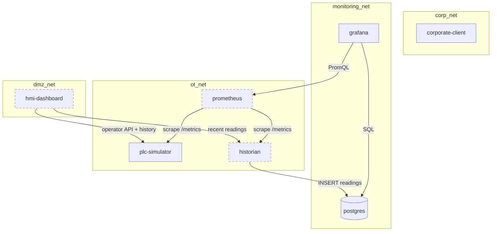

# Network zones

OT Lab-in-a-Box uses four named Docker networks to model the zones that a
real OT/IT environment would separate with firewalls and VLANs. The
purpose is **to be honest about what should be able to talk to what**, and
to make zone violations visible if they ever happen.

## Why zones?

Corporate IT systems (mail, HR, internet-facing tools) and OT control
systems (PLCs, HMIs, historians) live on different networks for good
reasons: blast-radius reduction, vendor support model, lifecycle, and
threat model. The historical anti-pattern — a flat network where corporate
users can directly reach a PLC — is exactly what this lab demonstrates
*not* having.

## The four zones

- **`corp_net`** — Corporate IT side. In the real world: workstations,
  email, browsers. Here: the `corporate-client` smoke-test container.
  Has no business reaching OT services directly.
- **`dmz_net`** — DMZ / jump zone. In the real world: gateways, jump
  hosts, web-published operator portals. Here: the `hmi-dashboard` nginx
  front, which is the only host-published OT-adjacent service.
- **`ot_net`** — OT control network. In the real world: PLCs, HMIs,
  control-network historians, engineering workstations. Here: the
  `plc-simulator`, the `historian`'s OT-facing leg, and Prometheus'
  scraping leg.
- **`monitoring_net`** — Observability zone. In the real world: SRE
  dashboards, log aggregators, time-series databases. Here: Grafana, the
  Postgres historian database, the `historian`'s monitoring-facing leg,
  and Prometheus' query-serving leg.

## Service placement

| Service           | corp_net | dmz_net | ot_net | monitoring_net |
|-------------------|:--------:|:-------:|:------:|:--------------:|
| corporate-client  |    ✓     |         |        |                |
| hmi-dashboard     |          |    ✓    |   ✓    |                |
| plc-simulator     |          |         |   ✓    |                |
| historian         |          |         |   ✓    |       ✓        |
| prometheus        |          |         |   ✓    |       ✓        |
| postgres          |          |         |        |       ✓        |
| grafana           |          |         |        |       ✓        |

Only two services are reachable from the host machine:

- `hmi-dashboard` on `:3000` (the operator portal)
- `grafana` on `:3001` (the engineer portal)

Everything else is internal to the compose network set.

## The bridges

Three services are deliberately multi-homed. Each carries one narrow,
explicit traffic class — that is what makes the bridging acceptable:

- **`hmi-dashboard`** is on `dmz_net` and `ot_net`. It exists so an
  operator in the DMZ can see process state and send a pump command into
  OT, *without* the operator's browser ever touching ot_net directly.
  nginx terminates the browser request and proxies into OT by container
  name.
- **`historian`** is on `ot_net` and `monitoring_net`. It exists to lift
  process readings out of OT and persist them on the monitoring side. OT
  data flows one way through it (poll on OT → write on monitoring).
- **`prometheus`** is on `ot_net` and `monitoring_net`. It exists to
  scrape `/metrics` from the OT services and serve PromQL on the
  monitoring side. The traffic is unidirectional: scrape-out on OT,
  serve-out on monitoring.

No other service may bridge zones. If a future change requires a fourth
bridge, document it here and add a row to the allowed traffic matrix.

## What Docker networks enforce — and don't

This lab is a **teaching model**, not a substitute for real OT security.
Be honest about what the implementation gives us:

- **Enforced by Docker networking.** A container that is not on a given
  network cannot resolve container names or route packets to services on
  that network. The `corporate-client` cannot reach `plc-simulator`
  because the names simply don't resolve from `corp_net`.
- **Not enforced.** Containers that *are* on the same network have full
  mutual access on every port. There is no per-port allow-list, no rate
  limiting, no deep packet inspection. The `hmi-dashboard`, while only
  intended to call `/api/state` and `/api/control/pump`, could in principle
  reach any TCP port on `plc-simulator` if it wanted to. In a real OT
  environment, firewalls, host-based controls, and (sometimes) a service
  mesh would add those constraints.

The lab's value is in **showing the topology and the intent**. Real
enforcement would be the next layer up.

## Verifying the model

A `corporate-client` container runs a startup self-test that probes every
forbidden cross-zone target it can name. Every probe should fail. See
[`runbook.md`](runbook.md#demonstrate-the-zone-model) for how to inspect
the results and run more probes interactively.

## Diagram

The source diagram lives at
[`diagrams/network-zones.mmd`](../diagrams/network-zones.mmd) for
re-rendering.
